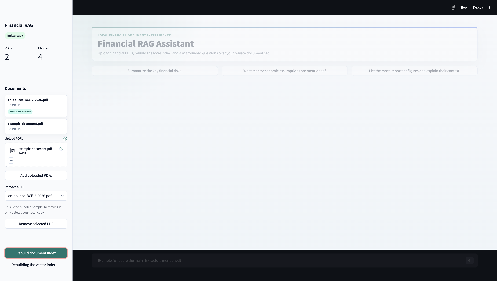
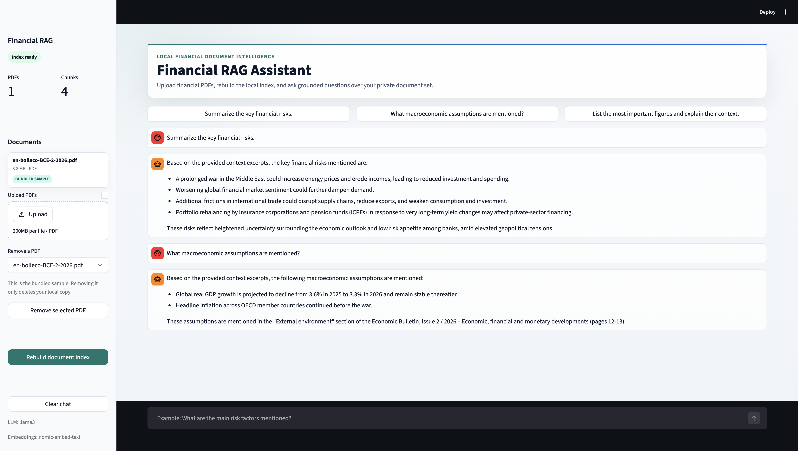

# Financial RAG Assistant

Financial RAG Assistant is a local Retrieval Augmented Generation application for querying financial PDF documents through a Streamlit chat interface.

It is built around a privacy-first architecture: PDF parsing, embedding generation, vector retrieval, and LLM inference all run locally with Ollama, LangChain, and Chroma. This makes the project suitable for experimenting with sensitive financial documents without sending document content to hosted AI services.

## Key Features

- **100% local execution**: Ollama runs the LLM and embedding model locally, so financial documents never leave the machine.
- **PDF-based RAG pipeline**: Upload PDFs, build a vector index, retrieve relevant chunks, and generate grounded answers.
- **Document management UI**: Upload, remove, inspect, and re-index PDFs directly from the sidebar.
- **Streamlit chat experience**: Ask natural-language questions, use quick prompts, and stop answer generation while it is running.
- **Modular codebase**: The app is split by responsibility across configuration, document indexing, RAG orchestration, UI, and styling modules.
- **Portfolio-ready demo**: Includes a sample financial PDF so the project can be tested immediately after setup.

## Architecture

The application separates the main workflow into small, focused modules:

```text
src/
|-- app.py        # Streamlit entrypoint and high-level orchestration
|-- config.py     # Paths, model names, retrieval settings, chunking parameters
|-- documents.py  # PDF listing, upload/removal, chunking, Chroma index rebuild
|-- rag.py        # LangChain RAG chain and prompt composition
|-- ui.py         # Streamlit sidebar, chat flow, quick prompts, interactions
|-- styles.py     # Custom visual styling
`-- ingest.py     # Optional CLI ingestion entrypoint
```

RAG flow:

```text
PDF files
  -> text extraction
  -> chunking
  -> local embeddings with nomic-embed-text
  -> Chroma vector index
  -> semantic retrieval
  -> local Llama 3 answer generation through Ollama
  -> Streamlit chat response
```

## Prerequisites

### 1. Install Python

Use Python 3.10 or newer.

### 2. Install Ollama

Install Ollama from the official website:

```text
https://ollama.ai
```

Start the Ollama runtime:

```bash
ollama serve
```

### 3. Pull the required local models

In another terminal, download the LLM and embedding model:

```bash
ollama pull llama3
ollama pull nomic-embed-text
```

Verify that the models are available:

```bash
ollama list
```

## Installation

Clone the repository:

```bash
git clone https://github.com/riccardo-pala/financial-rag.git
cd financial-rag
```

Create a virtual environment:

```bash
python -m venv venv
```

Activate it on macOS/Linux:

```bash
source venv/bin/activate
```

Activate it on Windows:

```powershell
venv\Scripts\activate
```

Install Python dependencies:

```bash
pip install -r requirements.txt
```

## Run the Streamlit App

Start the app:

```bash
streamlit run src/app.py
```

Open the local URL shown by Streamlit, usually:

```text
http://localhost:8501
```

## How to Use It

1. Start Ollama and the Streamlit app.
2. Use the sidebar to upload one or more PDF documents.
3. Click **Rebuild document index** to parse PDFs, create chunks, generate embeddings, and refresh the Chroma index.
4. Ask questions in the chat input.
5. Use **Stop generation** if you want to interrupt a running answer.
6. Use **Remove selected PDF** and rebuild the index when you want to change the document set.

The repository includes a sample financial PDF, so you can test the app immediately even before uploading your own documents.

## Screenshots

**Main app view after indexing the sample PDF**


**PDF upload and index rebuild workflow**



**Example RAG answer**


## Optional CLI Ingestion

The document index can also be rebuilt from the command line:

```bash
mkdir -p data
cp /path/to/your/documents/*.pdf data/
python src/ingest.py
```

Then run:

```bash
streamlit run src/app.py
```

## Configuration

Main runtime settings are centralized in `src/config.py`:

```python
EMBEDDING_MODEL = "nomic-embed-text"
LLM_MODEL = "llama3"
K_RESULTS = 4
CHUNK_SIZE = 1000
CHUNK_OVERLAP = 200
```

To use another local Ollama model, pull it first and then update `LLM_MODEL`.

## Technical Focus

This project demonstrates:

- local-first AI application design for sensitive financial data;
- separation of concerns across ingestion, retrieval, generation, and UI layers;
- LangChain LCEL composition for RAG orchestration;
- Chroma-based semantic retrieval;
- Streamlit UX for document upload, index refresh, chat, and generation control;
- practical RAG tuning points such as chunk size, overlap, and retrieval depth.

## Data Privacy

The system is designed to run entirely on the local machine:

- PDFs are read locally.
- Embeddings are generated locally through Ollama.
- The vector index is stored locally with Chroma.
- LLM responses are generated locally through Ollama.
- No hosted LLM API is required by the application.

## Limitations

- Only PDF documents are supported.
- OCR is not included, so scanned PDFs may require preprocessing.
- Answer quality depends on PDF text extraction and retrieval quality.
- Source citations are not currently displayed in the chat.
- Generated answers are not financial advice.

## Troubleshooting

### Uploaded documents are not reflected in answers

Click **Rebuild document index** in the sidebar after adding or removing PDFs.

### Index rebuild fails because the database is locked or read-only

If Chroma or SQLite reports a database write error, stop the Streamlit app and start it again:

```bash
streamlit run src/app.py
```

Then click **Rebuild document index** again. You can also rebuild the index from the command line:

```bash
python src/ingest.py
```

### Ollama model errors

Make sure Ollama is running and the required models are installed:

```bash
ollama serve
ollama list
```

## Development Workflow

This project was developed with a modern AI-assisted engineering workflow. AI assistance was used to accelerate implementation and iteration, while the human engineering focus remained on system architecture, RAG pipeline design, retrieval tuning, component integration, and product-level UX decisions.

## Disclaimer

This project is intended for local document exploration and research support. It does not provide investment, legal, accounting, or compliance advice. Always verify important outputs against the original source documents.

## License

This project is published for portfolio and interview purposes. No reuse license is currently granted.
